# Technical SPEC v2

## Codex CLI · tmux · LocalAgent · Central Agent Server · DiscordBot 연동 설계

## 0. 문서 목적

본 문서는 **Discord를 통해 tmux pane 안에서 실행 중인 Codex CLI 세션을 원격으로 관찰하고 제어하는 시스템**의 현재 구현 범위 설계를 정의한다.

현재 구현 대상은 다음으로 고정한다.

```text
CliAgent Provider              = Codex CLI
TerminalMultiplexer Provider   = tmux
RemoteConversation Provider    = Discord Thread
```

도메인 명칭은 특정 구현체 이름에 직접 종속시키지 않는다.
단, 이 프로젝트의 핵심 실행 기반이 **터미널 멀티플렉서와 pane 제어**이므로 다음 명칭을 사용한다.

```text
tmux                  → TerminalMultiplexer
tmux session          → TerminalSession
tmux window           → TerminalWindow
tmux pane             → TerminalPane
Codex CLI             → CliAgent
Discord thread        → RemoteConversation
```

---

# 1. 핵심 목표

```text
1. Codex CLI는 tmux pane 안에서 실행된다.
2. Codex hook event는 LocalAgent가 수신한다.
3. LocalAgent는 tmux pane 정보와 Codex transcript 정보를 수집한다.
4. LocalAgent는 수집한 이벤트를 Central Agent Server로 전송한다.
5. Central Agent Server는 통합 DB, 세션 매핑, 권한 요청, Discord 라우팅을 관리한다.
6. DiscordBot은 Discord thread에 이벤트와 결과를 표시한다.
7. 사용자는 Discord thread에 메시지를 보내 Codex CLI에 입력할 수 있다.
8. 사용자의 Discord 입력은 Central Agent Server를 거쳐 LocalAgent로 전달된다.
9. LocalAgent는 전달받은 입력을 tmux pane에 send-keys 방식으로 주입한다.
10. Codex 응답 완료 시 LocalAgent는 transcript JSONL에서 최종 응답을 추출해 Central Agent Server로 전송한다.
```

---

# 2. 전체 구조

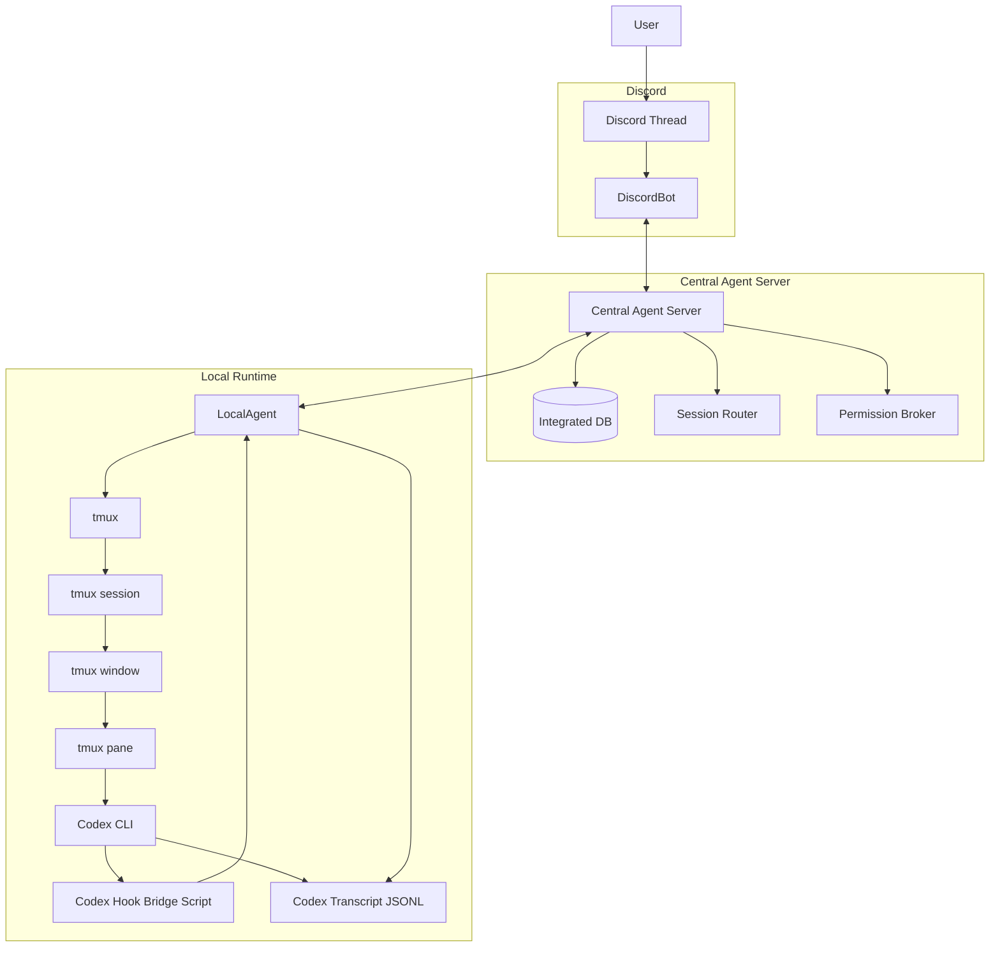

---

# 3. 주요 컴포넌트 책임

## 3.1 Codex CLI

Codex CLI는 실제 AI 작업을 수행하는 CLI agent다.

책임:

```text
1. 사용자 prompt 처리
2. tool 실행
3. hook event 발생
4. transcript JSONL 기록
5. permission request 발생
```

Codex CLI는 다음을 직접 하지 않는다.

```text
1. Discord와 통신하지 않는다.
2. Central Agent Server와 통신하지 않는다.
3. LocalAgent 상태를 직접 관리하지 않는다.
```

---

## 3.2 tmux

tmux는 현재 구현의 `TerminalMultiplexer` provider다.

책임:

```text
1. Codex CLI 프로세스가 살아 있는 terminal session 유지
2. session / window / pane 계층 관리
3. pane 단위 입력 수신
4. pane 화면 capture 제공
5. LocalAgent가 Codex CLI에 입력을 전달할 수 있는 terminal pane 제공
```

tmux는 다음을 직접 하지 않는다.

```text
1. Codex hook event를 해석하지 않는다.
2. Central Agent Server와 통신하지 않는다.
3. DiscordBot과 통신하지 않는다.
```

---

## 3.3 Codex Hook Bridge Script

Codex hook command에서 실행되는 얇은 bridge script다.

현재 `log-codex-hook.js`는 테스트용이며, 실제 운영 script가 아니다.
운영에서는 별도의 `codex-hook-bridge.sh` 또는 동등 script를 사용한다.

책임:

```text
1. Codex hook payload를 stdin으로 읽는다.
2. TMUX_PANE 환경값을 읽는다.
3. LocalAgent의 local endpoint를 호출한다.
4. LocalAgent 응답을 Codex hook stdout으로 반환한다.
5. LocalAgent 호출 실패 시 hook event 종류에 따라 fail-safe 응답을 반환한다.
```

Hook Bridge Script는 다음을 하지 않는다.

```text
1. Discord 직접 호출
2. Central Agent Server 직접 호출
3. DB 직접 접근
4. tmux 직접 조작
5. 복잡한 session state 관리
```

---

## 3.4 LocalAgent

LocalAgent는 로컬 실행 환경을 제어하는 agent다.

책임:

```text
1. Codex hook event 수신
2. TMUX_PANE 기반 tmux pane 정보 조회
3. tmux pane에 입력 전달
4. tmux pane 화면 capture
5. Codex transcript JSONL 읽기
6. Stop event 시 최종 assistant message 추출
7. Central Agent Server에 normalized event 전송
8. Central Agent Server로부터 terminal command 수신
9. PermissionRequest에 대한 decision을 Codex hook response로 반환
```

LocalAgent는 다음을 직접 하지 않는다.

```text
1. Discord Gateway 연결
2. Discord thread routing 판단
3. 사용자 권한 최종 판단
4. 통합 DB 직접 관리
5. 장기 audit log 관리
```

---

## 3.5 Central Agent Server

Central Agent Server는 시스템의 중앙 제어면이다.

책임:

```text
1. 통합 DB 관리
2. LocalAgent 등록 및 heartbeat 관리
3. Codex session 상태 관리
4. tmux terminal target 정보 관리
5. Discord thread binding 관리
6. Codex hook event 저장 및 정규화
7. DiscordBot에 알림 전송 요청
8. DiscordBot에서 들어온 사용자 입력 라우팅
9. PermissionRequest broker
10. 사용자 권한 검증
11. audit log 저장
```

Central Agent Server는 다음을 직접 하지 않는다.

```text
1. tmux command 실행
2. Codex transcript 파일 직접 읽기
3. Discord Gateway 직접 처리
4. Codex hook command 직접 실행
```

---

## 3.6 DiscordBot

DiscordBot은 Discord 전용 인터페이스 adapter다.

책임:

```text
1. Discord Gateway 연결
2. Discord messageCreate 수신
3. Discord button interaction 수신
4. Discord slash command 수신
5. Central Agent Server에 Discord event 전달
6. Central Agent Server 요청에 따라 Discord thread 생성
7. Central Agent Server 요청에 따라 메시지 전송
8. Central Agent Server 요청에 따라 permission button 렌더링
```

DiscordBot은 다음을 직접 하지 않는다.

```text
1. Codex event 해석
2. SessionBinding 판단
3. tmux pane 선택
4. LocalAgent 선택
5. 권한 정책 최종 판단
6. DB 직접 접근
```

---

# 4. 도메인 명칭 정의

## 4.1 RuntimeHost

`RuntimeHost`는 LocalAgent가 실행되는 물리적 또는 논리적 실행 환경이다.

예:

```text
- GitHub Codespace
- local machine
- dev server
- container
```

```pseudo
RuntimeHost {
  runtimeHostId
  hostName
  environmentType
  workspaceRoot
  operatingSystem
  status
  lastSeenAt
}
```

---

## 4.2 TerminalMultiplexer

`TerminalMultiplexer`는 CLI agent가 실행되는 터미널 세션, 윈도우, pane을 관리하는 멀티플렉서다.

현재 구현에서는 다음과 같다.

```text
TerminalMultiplexer = tmux
```

```pseudo
TerminalMultiplexer {
  terminalMultiplexerId
  runtimeHostId
  provider
  providerVersion
  status
}
```

현재 provider 값:

```text
tmux
```

---

## 4.3 TerminalSession

`TerminalSession`은 TerminalMultiplexer 안의 장기 실행 세션이다.

현재 구현에서는 다음과 같다.

```text
TerminalSession = tmux session
```

```pseudo
TerminalSession {
  terminalSessionId
  terminalMultiplexerId
  providerSessionId
  name
  workingDirectory
  status
}
```

예:

```pseudo
TerminalSession {
  terminalSessionId: "terminal_session_01"
  terminalMultiplexerId: "terminal_multiplexer_01"
  providerSessionId: "codex-main"
  name: "codex-main"
  workingDirectory: "/workspaces/jeongrae"
  status: "active"
}
```

---

## 4.4 TerminalWindow

`TerminalWindow`는 TerminalSession 내부의 window 단위다.

현재 구현에서는 다음과 같다.

```text
TerminalWindow = tmux window
```

```pseudo
TerminalWindow {
  terminalWindowId
  terminalSessionId
  providerWindowId
  title
  workingDirectory
  status
}
```

예:

```pseudo
TerminalWindow {
  terminalWindowId: "terminal_window_01"
  terminalSessionId: "terminal_session_01"
  providerWindowId: "@3"
  title: "jeongrae"
  workingDirectory: "/workspaces/jeongrae"
  status: "active"
}
```

---

## 4.5 TerminalPane

`TerminalPane`은 LocalAgent가 실제로 입력을 보내고 화면을 캡처하는 터미널 입출력 pane이다.

현재 구현에서는 다음과 같다.

```text
TerminalPane = tmux pane
```

```pseudo
TerminalPane {
  terminalPaneId
  terminalWindowId
  providerPaneId
  providerWindowId
  providerSessionId
  workingDirectory
  status
}
```

예:

```pseudo
TerminalPane {
  terminalPaneId: "terminal_pane_01"
  terminalWindowId: "terminal_window_01"
  providerPaneId: "%12"
  providerWindowId: "@3"
  providerSessionId: "codex-main"
  workingDirectory: "/workspaces/jeongrae"
  status: "active"
}
```

---

## 4.6 CliAgent

`CliAgent`는 터미널 안에서 실행되는 AI CLI agent다.

현재 구현에서는 다음과 같다.

```text
CliAgent = Codex CLI
```

```pseudo
CliAgent {
  cliAgentId
  provider
  displayName
  executableName
  version
}
```

예:

```pseudo
CliAgent {
  cliAgentId: "cli_agent_codex"
  provider: "codex"
  displayName: "Codex CLI"
  executableName: "codex"
}
```

---

## 4.7 CliAgentSession

`CliAgentSession`은 특정 CliAgent가 특정 TerminalPane 안에서 실행 중인 세션이다.

현재 구현에서는 다음과 같다.

```text
CliAgentSession.providerSessionId = Codex session_id
```

```pseudo
CliAgentSession {
  cliAgentSessionId
  cliAgentId
  providerSessionId
  terminalPaneId
  workingDirectory
  model
  permissionMode
  transcriptRef
  lifecycleState
  startedAt
  lastSeenAt
}
```

예:

```pseudo
CliAgentSession {
  cliAgentSessionId: "cli_agent_session_01"
  cliAgentId: "cli_agent_codex"
  providerSessionId: "019de2fd-43f4-7bf1-afe2-2555c15df7f8"
  terminalPaneId: "terminal_pane_01"
  workingDirectory: "/workspaces/jeongrae"
  model: "gpt-5.4"
  permissionMode: "bypassPermissions"
  transcriptRef: "agent_transcript_01"
  lifecycleState: "active"
}
```

---

## 4.8 AgentTranscript

`AgentTranscript`는 CliAgent가 기록하는 structured output source다.

현재 구현에서는 다음과 같다.

```text
AgentTranscript = Codex transcript_path JSONL
```

```pseudo
AgentTranscript {
  agentTranscriptId
  cliAgentSessionId
  provider
  path
  format
  lastReadOffset
  readable
}
```

예:

```pseudo
AgentTranscript {
  agentTranscriptId: "agent_transcript_01"
  cliAgentSessionId: "cli_agent_session_01"
  provider: "codex"
  path: "/home/codespace/.codex/sessions/2026/05/01/rollout-....jsonl"
  format: "jsonl"
  lastReadOffset: 0
  readable: true
}
```

---

## 4.9 AgentTurn

`AgentTurn`은 사용자의 prompt 1회에 대한 처리 단위다.

현재 구현에서는 다음과 같다.

```text
AgentTurn.providerTurnId = Codex turn_id
```

```pseudo
AgentTurn {
  agentTurnId
  cliAgentSessionId
  providerTurnId
  prompt
  source
  status
  startedAt
  completedAt
}
```

source 값:

```text
discord
terminal
unknown
```

예:

```pseudo
AgentTurn {
  agentTurnId: "agent_turn_01"
  cliAgentSessionId: "cli_agent_session_01"
  providerTurnId: "019de2fd-bac9-7dc2-b3f0-2daee44e7bce"
  prompt: "discord bot을 만드는 방법에 대하여 설명해줘."
  source: "discord"
  status: "running"
}
```

---

## 4.10 AgentToolUse

`AgentToolUse`는 CliAgent가 실행한 tool invocation이다.

현재 구현에서는 다음과 같다.

```text
AgentToolUse.providerToolUseId = Codex tool_use_id
```

```pseudo
AgentToolUse {
  agentToolUseId
  cliAgentSessionId
  agentTurnId
  providerToolUseId
  toolName
  toolInput
  toolResponseSummary
  status
  startedAt
  completedAt
}
```

예:

```pseudo
AgentToolUse {
  agentToolUseId: "agent_tool_use_01"
  cliAgentSessionId: "cli_agent_session_01"
  agentTurnId: "agent_turn_01"
  providerToolUseId: "call_lK0RRUMYUV5Z9tFXmNEcGtf9"
  toolName: "Bash"
  toolInput: {
    command: "pwd && rg --files"
  }
  status: "completed"
}
```

---

## 4.11 PermissionRequest

`PermissionRequest`는 Codex가 특정 tool 실행 전에 사용자 승인을 요구하는 요청이다.

현재 구현에서는 다음과 같다.

```text
PermissionRequest = Codex PermissionRequest hook
```

```pseudo
PermissionRequest {
  permissionRequestId
  cliAgentSessionId
  agentTurnId
  agentToolUseId
  requestedAction
  status
  decision
  reason
  requestedAt
  decidedAt
  timeoutAt
}
```

상태:

```text
requested
waiting_user_decision
allowed
denied
timed_out
```

---

## 4.12 RemoteConversation

`RemoteConversation`은 사용자가 원격에서 CliAgentSession과 대화하는 공간이다.

현재 구현에서는 다음과 같다.

```text
RemoteConversation = Discord thread
```

```pseudo
RemoteConversation {
  remoteConversationId
  provider
  workspaceId
  channelId
  threadId
  displayName
  status
}
```

Discord 기준:

```text
workspaceId = guildId
channelId   = channelId
threadId    = threadId
```

예:

```pseudo
RemoteConversation {
  remoteConversationId: "remote_conversation_01"
  provider: "discord"
  workspaceId: "guild_123"
  channelId: "channel_456"
  threadId: "thread_789"
  displayName: "codex · jeongrae · 019de2fd"
  status: "active"
}
```

---

## 4.13 SessionBinding

`SessionBinding`은 RemoteConversation과 CliAgentSession, TerminalPane을 연결하는 routing 객체다.

```pseudo
SessionBinding {
  sessionBindingId
  remoteConversationId
  cliAgentSessionId
  terminalPaneId
  runtimeHostId
  status
  createdAt
}
```

핵심 라우팅:

```text
Discord thread
  → RemoteConversation
  → SessionBinding
  → CliAgentSession
  → TerminalPane
  → RuntimeHost
  → LocalAgent
```

예:

```pseudo
SessionBinding {
  sessionBindingId: "session_binding_01"
  remoteConversationId: "remote_conversation_01"
  cliAgentSessionId: "cli_agent_session_01"
  terminalPaneId: "terminal_pane_01"
  runtimeHostId: "runtime_host_01"
  status: "active"
}
```

---

## 4.14 UserCommand

`UserCommand`는 Discord 사용자가 보낸 입력 또는 제어 명령이다.

```pseudo
UserCommand {
  userCommandId
  remoteConversationId
  cliAgentSessionId
  userId
  commandType
  content
  status
  requestedAt
  executedAt
}
```

commandType:

```text
agent.input
terminal.capture
permission.allow
permission.deny
```

예:

```pseudo
UserCommand {
  userCommandId: "user_command_01"
  remoteConversationId: "remote_conversation_01"
  cliAgentSessionId: "cli_agent_session_01"
  userId: "user_01"
  commandType: "agent.input"
  content: "이어서 테스트 코드를 작성해줘."
  status: "requested"
}
```

---

## 4.15 AgentEvent

`AgentEvent`는 Codex hook event를 시스템 내부에서 사용하는 정규화 이벤트다.

```pseudo
AgentEvent {
  agentEventId
  eventType
  provider
  runtimeHostId
  cliAgentSessionId
  agentTurnId
  agentToolUseId
  occurredAt
  receivedAt
  payload
  rawPayloadRef
}
```

eventType:

```text
agent.session.started
agent.turn.started
agent.tool.started
agent.permission.requested
agent.tool.completed
agent.turn.completed
runtime.host.offline
terminal.input.sent
```

---

# 5. 도메인 관계

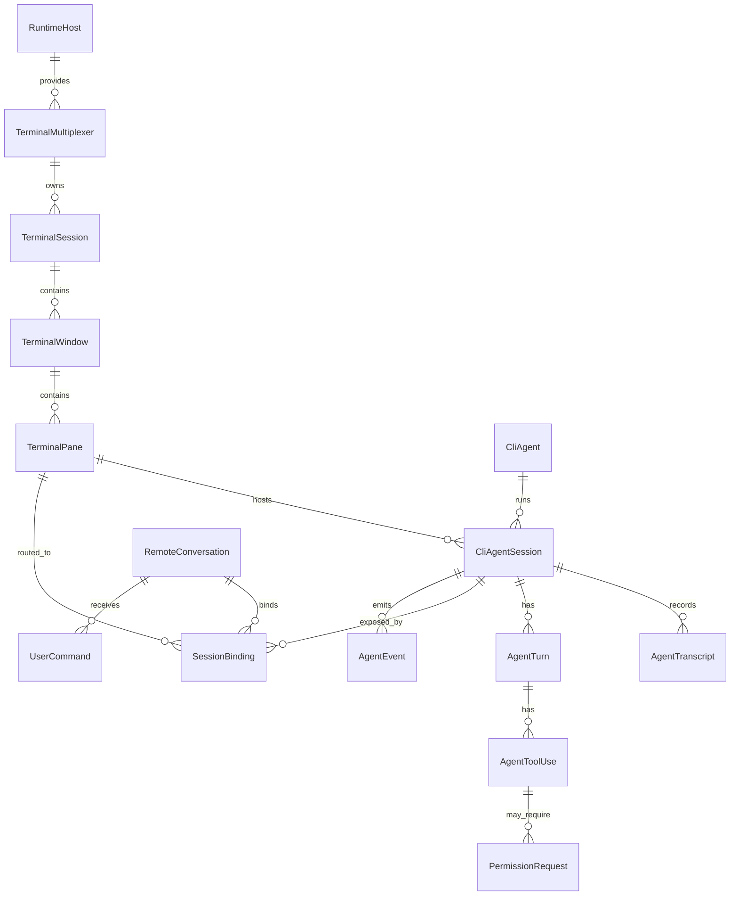

---

# 6. Provider Profile

현재 범위에서 Provider Profile은 세 개만 정의한다.

```text
1. CodexCliAgentProfile
2. TmuxTerminalMultiplexerProfile
3. DiscordRemoteConversationProfile
```

---

## 6.1 CodexCliAgentProfile

```pseudo
CodexCliAgentProfile {
  provider: "codex"
  displayName: "Codex CLI"

  hook {
    enabled: true
    events: [
      "SessionStart",
      "UserPromptSubmit",
      "PreToolUse",
      "PermissionRequest",
      "PostToolUse",
      "Stop"
    ]
    payloadFormat: "json"
    deliveryMode: "command_stdin"
  }

  identity {
    sessionId: "payload.session_id"
    turnId: "payload.turn_id"
    toolUseId: "payload.tool_use_id"
    transcriptPath: "payload.transcript_path"
  }

  transcript {
    enabled: true
    format: "jsonl"
    path: "payload.transcript_path"
    finalResultExtraction: "by_turn_id"
  }

  permission {
    enabled: true
    requestEvent: "PermissionRequest"
    decisionMode: "hook_response"
    timeoutSeconds: 60
    timeoutDecision: "deny"
  }

  eventMapping {
    "SessionStart": "agent.session.started"
    "UserPromptSubmit": "agent.turn.started"
    "PreToolUse": "agent.tool.started"
    "PermissionRequest": "agent.permission.requested"
    "PostToolUse": "agent.tool.completed"
    "Stop": "agent.turn.completed"
  }
}
```

---

## 6.2 TmuxTerminalMultiplexerProfile

```pseudo
TmuxTerminalMultiplexerProfile {
  provider: "tmux"
  displayName: "tmux"

  identity {
    paneIdentitySource: "environment.TMUX_PANE"
    resolveCommand: "tmux display-message"
    sessionName: "#{session_name}"
    windowId: "#{window_id}"
    paneId: "#{pane_id}"
    currentPath: "#{pane_current_path}"
  }

  input {
    mode: "send-keys"
    submitKey: "Enter"
    delayedSubmit: true
    delayMilliseconds: 300
  }

  capture {
    mode: "capture-pane"
    supportsAnsi: true
  }
}
```

---

## 6.3 DiscordRemoteConversationProfile

```pseudo
DiscordRemoteConversationProfile {
  provider: "discord"
  displayName: "Discord"

  conversation {
    unit: "thread"
    identityFields: [
      "guildId",
      "channelId",
      "threadId"
    ]
    displayNamePolicy: "codex + workspace + session-short-id"
  }

  message {
    maxLength: 2000
    supportsAttachments: true
  }

  interaction {
    supportsButtons: true
    supportsSlashCommands: true
  }
}
```

---

# 7. Codex Hook 설정

현재 hook 설정은 테스트용 `log-codex-hook.js`를 호출한다.
운영에서는 실제 hook bridge script로 교체한다.

예시:

```toml
[features]
codex_hooks = true

[hooks]
SessionStart = [
  { matcher = "startup|resume|clear", hooks = [
    { type = "command", command = "\"$(git rev-parse --show-toplevel)/agent/codex-hook-bridge.sh\"" }
  ] }
]

PreToolUse = [
  { matcher = "*", hooks = [
    { type = "command", command = "\"$(git rev-parse --show-toplevel)/agent/codex-hook-bridge.sh\"" }
  ] }
]

PermissionRequest = [
  { matcher = "*", hooks = [
    { type = "command", command = "\"$(git rev-parse --show-toplevel)/agent/codex-hook-bridge.sh\"" }
  ] }
]

PostToolUse = [
  { matcher = "*", hooks = [
    { type = "command", command = "\"$(git rev-parse --show-toplevel)/agent/codex-hook-bridge.sh\"" }
  ] }
]

UserPromptSubmit = [
  { hooks = [
    { type = "command", command = "\"$(git rev-parse --show-toplevel)/agent/codex-hook-bridge.sh\"" }
  ] }
]

Stop = [
  { hooks = [
    { type = "command", command = "\"$(git rev-parse --show-toplevel)/agent/codex-hook-bridge.sh\"" }
  ] }
]
```

---

# 8. Hook Bridge Script 동작

```pseudo
main():
    rawPayload = readStdin()
    hookEventName = parse(rawPayload).hook_event_name
    tmuxPane = readEnv("TMUX_PANE")

    timeout = 5 seconds

    if hookEventName == "PermissionRequest":
        timeout = 65 seconds

    response = httpPost(
        url = "http://127.0.0.1:{LOCAL_AGENT_PORT}/internal/codex/hooks",
        headers = {
            "Content-Type": "application/json",
            "X-Tmux-Pane": tmuxPane
        },
        body = rawPayload,
        timeout = timeout
    )

    if response.failed:
        if hookEventName == "PermissionRequest":
            print(denyResponse("LocalAgent unavailable"))
        else:
            print("{}")

        exit(0)

    print(response.body)
    exit(0)
```

---

# 9. LocalAgent Hook 수신 처리

## 9.1 Endpoint

```http
POST /internal/codex/hooks
Content-Type: application/json
X-Tmux-Pane: %12
```

## 9.2 처리 흐름

```pseudo
handleCodexHook(request):
    rawPayload = request.body
    tmuxPane = request.header["X-Tmux-Pane"]

    codexEvent = parseCodexHookPayload(rawPayload)
    terminalPane = resolveTmuxPane(tmuxPane)

    agentEvent = normalizeCodexEvent(codexEvent)

    if codexEvent.name == "SessionStart":
        publishSessionStarted(agentEvent, terminalPane)
        return {}

    if codexEvent.name == "UserPromptSubmit":
        publishTurnStarted(agentEvent, terminalPane)
        return {}

    if codexEvent.name == "PreToolUse":
        publishToolStarted(agentEvent, terminalPane)
        return {}

    if codexEvent.name == "PermissionRequest":
        return handlePermissionRequest(agentEvent, terminalPane)

    if codexEvent.name == "PostToolUse":
        publishToolCompleted(agentEvent, terminalPane)
        return {}

    if codexEvent.name == "Stop":
        finalMessage = extractFinalMessage(
            transcriptPath = codexEvent.transcriptPath,
            turnId = codexEvent.turnId
        )

        publishTurnCompleted(agentEvent, terminalPane, finalMessage)
        return {}

    return {}
```

---

# 10. tmux Pane 해석

LocalAgent는 hook bridge script가 넘긴 `TMUX_PANE` 값을 기준으로 tmux pane을 해석한다.

```pseudo
resolveTmuxPane(tmuxPane):
    output = execute(
        "tmux",
        [
          "display-message",
          "-t",
          tmuxPane,
          "-p",
          "#{session_name}:#{window_id}:#{pane_id}:#{window_name}:#{pane_current_path}"
        ]
    )

    return TerminalPaneDescriptor {
        provider: "tmux"
        providerSessionId
        providerWindowId
        providerPaneId
        windowName
        workingDirectory
    }
```

예상 결과:

```text
codex-main:@3:%12:jeongrae:/workspaces/jeongrae
```

---

# 11. Codex Event 정규화

## 11.1 Event Mapping

| Codex Hook Event    | AgentEvent                   |
| ------------------- | ---------------------------- |
| `SessionStart`      | `agent.session.started`      |
| `UserPromptSubmit`  | `agent.turn.started`         |
| `PreToolUse`        | `agent.tool.started`         |
| `PermissionRequest` | `agent.permission.requested` |
| `PostToolUse`       | `agent.tool.completed`       |
| `Stop`              | `agent.turn.completed`       |

## 11.2 정규화 pseudo

```pseudo
normalizeCodexEvent(codexEvent):
    eventType = CodexCliAgentProfile.eventMapping[codexEvent.hookEventName]

    return AgentEvent {
        eventType: eventType
        provider: "codex"
        providerSessionId: codexEvent.sessionId
        providerTurnId: codexEvent.turnId
        providerToolUseId: codexEvent.toolUseId
        transcriptPath: codexEvent.transcriptPath
        model: codexEvent.model
        permissionMode: codexEvent.permissionMode
        rawPayload: codexEvent.rawPayload
    }
```

---

# 12. Central Agent Server 수신 처리

LocalAgent는 모든 hook event를 Central Agent Server로 전송한다.

## 12.1 Endpoint

```http
POST /api/local-agents/{runtimeHostId}/agent-events
```

## 12.2 Event Envelope

```pseudo
AgentEventEnvelope {
  runtimeHost: RuntimeHostDescriptor
  terminalMultiplexer: TerminalMultiplexerDescriptor
  terminalSession: TerminalSessionDescriptor
  terminalWindow: TerminalWindowDescriptor
  terminalPane: TerminalPaneDescriptor
  cliAgentSession: CliAgentSessionDescriptor
  transcript: AgentTranscriptDescriptor
  event: AgentEvent
  finalMessage?
  rawPayload
}
```

---

# 13. SessionStart 처리

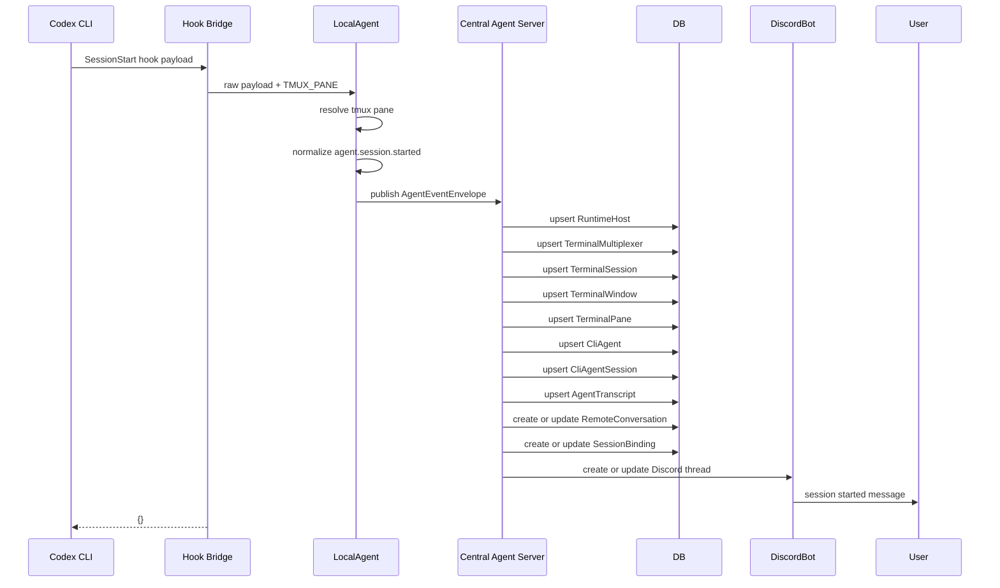

---

# 14. Discord 사용자 입력 처리

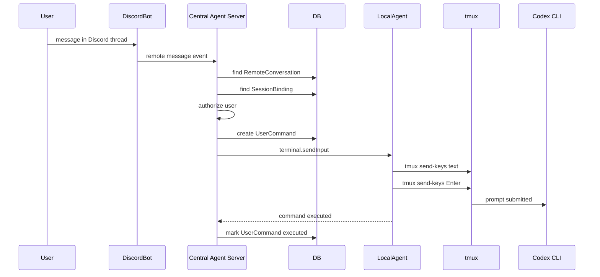

## 14.1 LocalAgent 입력 처리 pseudo

```pseudo
sendInputToTerminalPane(command):
    pane = command.targetTerminalPane

    execute(
        "tmux",
        [
          "send-keys",
          "-t",
          pane.providerPaneId,
          "--",
          command.content
        ]
    )

    sleep(300ms)

    execute(
        "tmux",
        [
          "send-keys",
          "-t",
          pane.providerPaneId,
          "Enter"
        ]
    )

    return success
```

---

# 15. Tool Use 처리

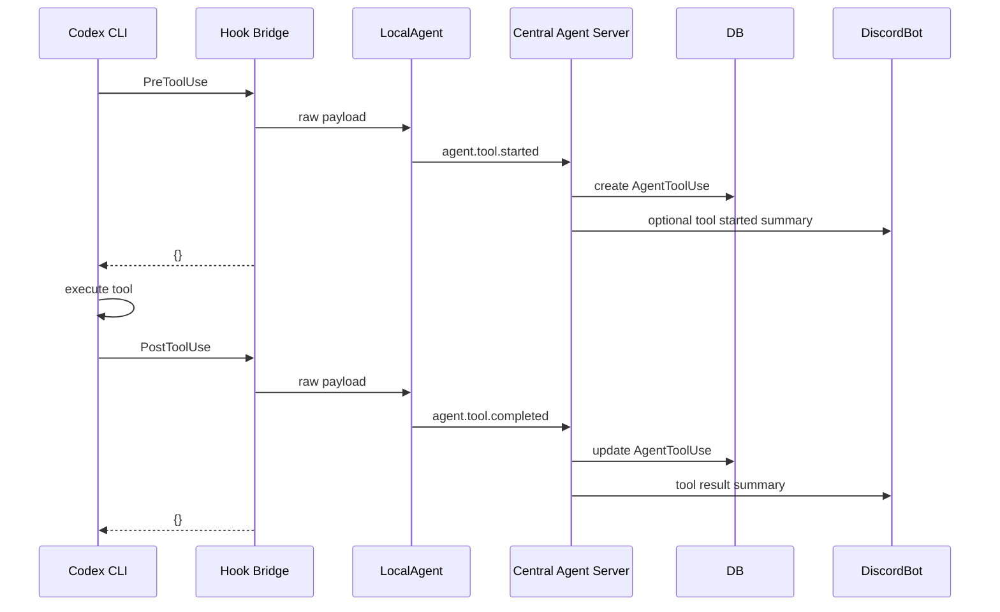

## 15.1 Tool Response 처리 정책

`tool_response`는 그대로 Discord에 전송하지 않는다.

```pseudo
summarizeToolResponse(response):
    masked = maskSecrets(response)
    normalized = normalizeLineEndings(masked)

    if looksLikeBinary(normalized):
        return "[binary output omitted]"

    if length(normalized) > 1500:
        return substring(normalized, 0, 1500) + "\n... truncated"

    return normalized
```

---

# 16. PermissionRequest 처리

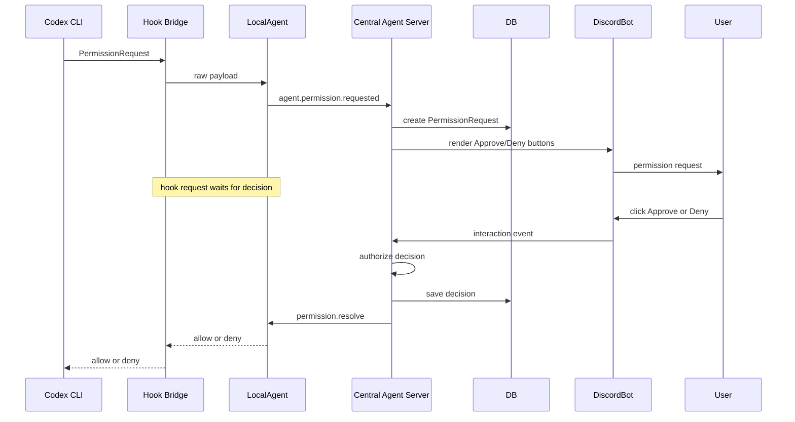

## 16.1 Permission timeout

```text
timeoutSeconds = 60
timeoutDecision = deny
```

```pseudo
handlePermissionRequest(agentEvent):
    permissionRequest = publishPermissionRequestToCentral(agentEvent)

    decision = waitForDecision(
        permissionRequestId = permissionRequest.id,
        timeout = 60 seconds
    )

    if decision.timeout:
        return deny("Permission request timed out")

    if decision.allowed:
        return allow(decision.reason)

    return deny(decision.reason)
```

---

# 17. Stop 및 최종 결과 처리

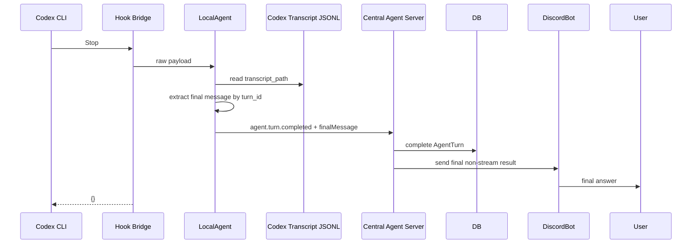

## 17.1 Transcript extraction pseudo

```pseudo
extractFinalMessage(transcriptPath, turnId):
    lines = readJsonLines(transcriptPath)

    matchedMessages = []

    for line in lines:
        event = parseJson(line)

        if belongsToTurn(event, turnId) and isAssistantMessage(event):
            matchedMessages.append(event)

    if matchedMessages is empty:
        matchedMessages = findRecentAssistantMessages(lines)

    finalMessage = mergeAssistantMessages(matchedMessages)

    return sanitizeAndTruncate(finalMessage)
```

---

# 18. Central DB 모델

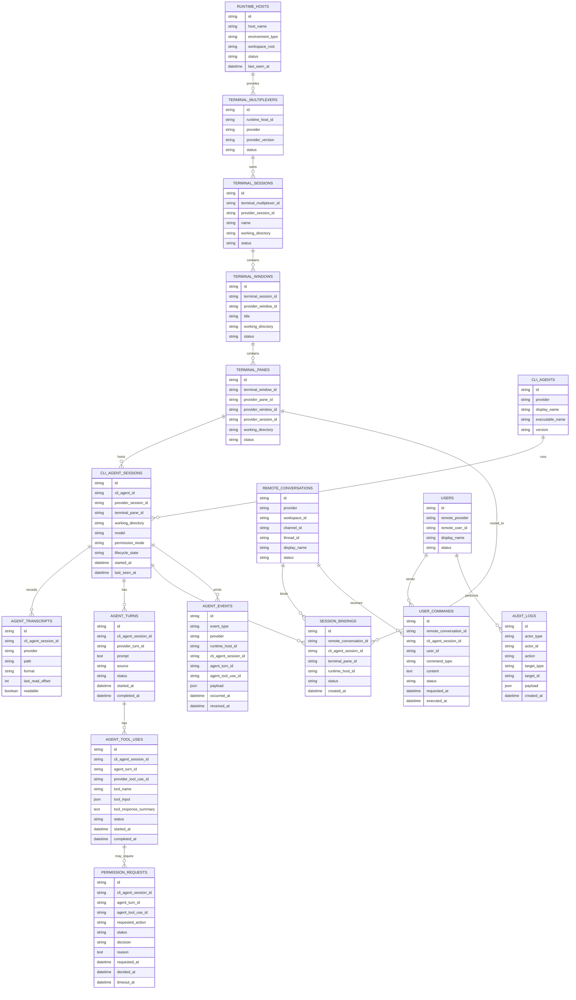

---

# 19. 상태 모델

## 19.1 CliAgentSession 상태

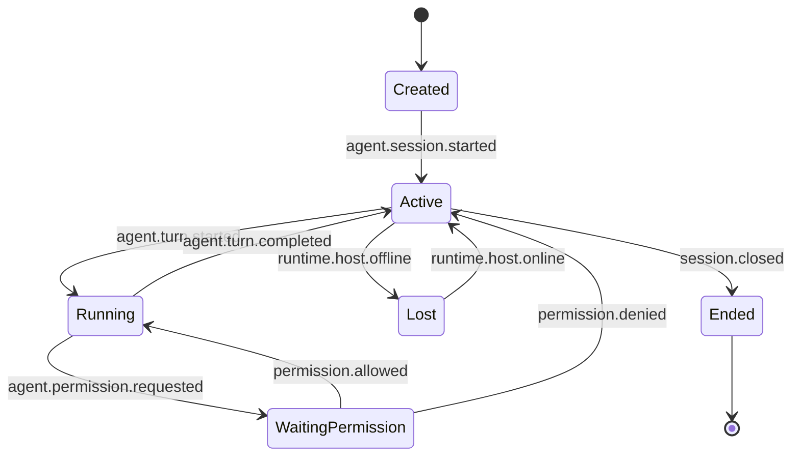

---

## 19.2 AgentTurn 상태

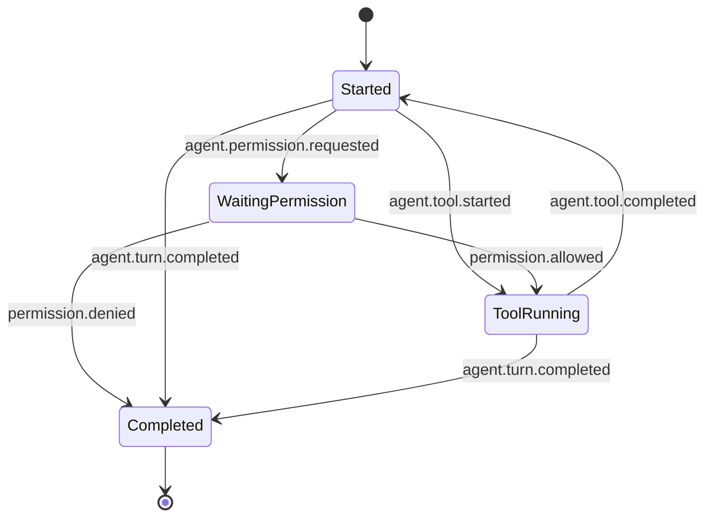

---

## 19.3 PermissionRequest 상태

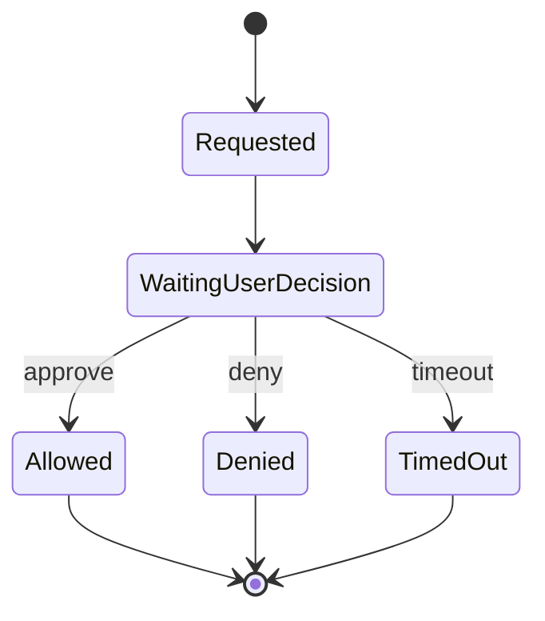

---

# 20. API 경계

## 20.1 Hook Bridge → LocalAgent

```http
POST /internal/codex/hooks
Content-Type: application/json
X-Tmux-Pane: %12
```

일반 응답:

```json
{}
```

Permission 허용 응답 예:

```json
{
  "decision": "allow",
  "reason": "Approved from Discord"
}
```

Permission 거부 응답 예:

```json
{
  "decision": "deny",
  "reason": "Denied from Discord"
}
```

---

## 20.2 LocalAgent → Central Agent Server

```http
POST /api/local-agents/{runtimeHostId}/agent-events
```

```pseudo
AgentEventEnvelope {
  runtimeHost
  terminalMultiplexer
  terminalSession
  terminalWindow
  terminalPane
  cliAgentSession
  transcript
  event
  finalMessage?
  rawPayload
}
```

---

## 20.3 Central Agent Server → LocalAgent

Central Agent Server는 LocalAgent로 명령을 보낸다.

권장 통신 방식은 LocalAgent가 Central Agent Server에 outbound connection을 유지하는 방식이다.

Command 예:

```pseudo
TerminalCommand {
  commandId
  commandType: "terminal.sendInput"
  targetTerminalPaneId
  providerPaneId
  content
  requestedBy
}
```

---

## 20.4 DiscordBot → Central Agent Server

Discord message event:

```http
POST /api/discord/messages
```

```pseudo
DiscordMessageEvent {
  guildId
  channelId
  threadId
  userId
  content
  attachments
}
```

Discord interaction event:

```http
POST /api/discord/interactions
```

```pseudo
DiscordInteractionEvent {
  interactionId
  guildId
  channelId
  threadId
  userId
  customId
}
```

---

## 20.5 Central Agent Server → DiscordBot

메시지 전송 요청:

```pseudo
DiscordSendMessageCommand {
  commandId
  guildId
  channelId
  threadId
  content
  components?
}
```

thread 생성 요청:

```pseudo
DiscordCreateThreadCommand {
  commandId
  guildId
  channelId
  name
  initialMessage
}
```

---

# 21. Discord 출력 정책

## 21.1 이벤트별 출력

| Event                        | Discord 출력  |
| ---------------------------- | ----------- |
| `agent.session.started`      | 출력          |
| `agent.turn.started`         | 간단 상태 출력    |
| `agent.tool.started`         | 선택적 요약 출력   |
| `agent.permission.requested` | 승인/거부 버튼 출력 |
| `agent.tool.completed`       | 요약 출력       |
| `agent.turn.completed`       | 최종 응답 출력    |
| `runtime.host.offline`       | 출력          |

---

## 21.2 최종 응답

최종 응답은 stream하지 않는다.

```text
Codex Stop hook
  → LocalAgent가 transcript_path 읽기
  → turn_id 기준 최종 assistant message 추출
  → Central Agent Server 저장
  → DiscordBot이 Discord thread에 한 번에 출력
```

---

# 22. 보안 요구사항

## 22.1 LocalAgent

```text
1. Hook endpoint는 localhost only로 노출한다.
2. Central Agent Server와 통신할 때 agent token을 사용한다.
3. tmux target은 등록된 TerminalPane만 허용한다.
4. workspace root allowlist를 적용한다.
5. Discord 입력을 shell eval하지 않는다.
6. Discord 입력은 tmux send-keys를 통한 Codex TUI 입력으로만 전달한다.
7. tmux command 실행은 argument array 기반으로 수행한다.
```

---

## 22.2 Central Agent Server

```text
1. Discord guild allowlist를 적용한다.
2. Discord channel allowlist를 적용한다.
3. Discord user 또는 role 기반 권한 검증을 수행한다.
4. SessionBinding 없는 입력은 거부한다.
5. Permission decision은 audit log에 기록한다.
6. UserCommand는 audit log에 기록한다.
7. raw hook payload는 secret masking 후 저장한다.
```

---

## 22.3 DiscordBot

```text
1. bot 자신의 메시지는 무시한다.
2. 모든 Discord event는 Central Agent Server로 전달한다.
3. SessionBinding 판단은 Central Agent Server에 위임한다.
4. Permission decision 판단은 Central Agent Server에 위임한다.
```

---

# 23. 장애 처리

## 23.1 Hook Bridge 실패

```text
일반 hook:
  {}

PermissionRequest:
  deny
```

---

## 23.2 LocalAgent offline

```text
1. Central Agent Server가 heartbeat timeout 감지
2. RuntimeHost 상태를 offline으로 변경
3. 연결된 CliAgentSession을 Lost 상태로 변경
4. Discord thread에 offline 알림 전송
5. 사용자 입력은 거부한다
```

---

## 23.3 Transcript 읽기 실패

```text
1. agent.turn.completed 이벤트는 저장한다.
2. finalMessage는 unavailable로 처리한다.
3. Discord에는 transcript extraction 실패 메시지를 출력한다.
4. 사용자가 terminal.capture 명령으로 현재 화면을 확인할 수 있게 한다.
```

---

# 24. MVP 구현 범위

## Phase 1 — Hook Ingestion

```text
1. Codex hook bridge script
2. LocalAgent /internal/codex/hooks
3. TMUX_PANE 기반 tmux pane 해석
4. Codex hook event 정규화
5. Central Agent Server event 저장
```

## Phase 2 — Session Binding

```text
1. SessionStart 처리
2. RuntimeHost 저장
3. TerminalMultiplexer 저장
4. TerminalSession / TerminalWindow / TerminalPane 저장
5. CliAgentSession 저장
6. AgentTranscript 저장
7. Discord thread 생성
8. SessionBinding 생성
```

## Phase 3 — Discord 입력

```text
1. DiscordBot messageCreate 수신
2. Central Agent Server가 SessionBinding 조회
3. UserCommand 생성
4. LocalAgent terminal.sendInput
5. tmux send-keys
```

## Phase 4 — Stop 결과 출력

```text
1. Stop hook 수신
2. LocalAgent가 Codex transcript_path 읽기
3. turn_id 기준 final message 추출
4. Discord thread에 non-stream 최종 응답 출력
```

## Phase 5 — PermissionRequest

```text
1. PermissionRequest hook 수신
2. Central Agent Server PermissionRequest 생성
3. DiscordBot 승인/거부 버튼 출력
4. 사용자 decision 저장
5. LocalAgent가 hook response 반환
```

---

# 25. 최종 요약

현재 시스템의 실제 대상은 다음이다.

```text
Codex CLI
  ↔ tmux
  ↔ LocalAgent
  ↔ Central Agent Server
  ↔ DiscordBot
  ↔ User
```

도메인 명칭은 다음을 사용한다.

```text
tmux                  → TerminalMultiplexer
tmux session          → TerminalSession
tmux window           → TerminalWindow
tmux pane             → TerminalPane
Codex CLI             → CliAgent
Codex session_id      → CliAgentSession.providerSessionId
Codex transcript_path → AgentTranscript.path
Codex turn_id         → AgentTurn.providerTurnId
Codex tool_use_id     → AgentToolUse.providerToolUseId
Discord thread        → RemoteConversation
Discord thread binding→ SessionBinding
```

핵심 설계 문장:

```text
LocalAgent는 로컬 실행 제어면이다.
Central Agent Server는 상태·정책·라우팅 제어면이다.
DiscordBot은 Discord 사용자 인터페이스 adapter다.
tmux는 현재 TerminalMultiplexer provider다.
Codex CLI는 현재 CliAgent provider다.
Discord thread는 현재 RemoteConversation provider다.
```

이 SPEC v2는 현재 구현 범위인 **Codex CLI + tmux + Discord**에만 집중한다.
